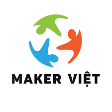

<div align="center">
  

  # NeoStopMotion

  **Maker Việt × ThingEdu — NEO One**

  Stop-motion studio cho trẻ em 6-14 tuổi. Chụp frame bằng nút bấm vật lý ThingBot (UART), ghép phim MP4+GIF kèm watermark Maker Việt, upload tự động lên cloud, sinh QR code cho phụ huynh quét tải về.

  [](https://github.com/makerviet/NeoStopMotion)
  [](LICENSE)
</div>

---

## ✨ Tính năng v1.0

- **Live preview** webcam với **onion skin** (frame trước hiện mờ chồng lên)
- **2 nút ThingBot**: IO1 (xanh) chụp frame · IO2 (đỏ) tạo phim
- Phím tắt: `Space`, `Z` (undo), `Enter` (export)
- Ghép phim **MP4** (H.264 1280×720 10fps) + **GIF** (640×360 palette) qua ffmpeg
- **Watermark Maker Việt** logo nhúng vào mỗi frame video (góc dưới phải, 85% opacity)
- **Upload cloud tự động** (catbox.moe vĩnh viễn, fallback 0x0.st)
- **QR code** sinh local trỏ tới link cloud
- **Auto-reset**: bấm IO1 trên SuccessPage để bắt đầu phim mới ngay
- Onion skin chỉ ở live preview, **không** ghi vào file (giữ chất lượng)
- Synthetic capture fallback cho dev không có webcam

## 🎬 Trải nghiệm 25-30 phút (cho HS 6-14 tuổi)

```
1. Đón tiếp + flipbook 20 trang giải thích nguyên lý hoạt hình
2. Chọn vật liệu (hộp A đơn giản hoặc hộp B mở)
3. Sắp đặt sân khấu trên mặt phẳng 60×60cm
4. Chụp 30-50 frame:
   bấm IO1 → tách → di chuyển nhân vật → bấm IO1 → ...
5. Bấm IO2 → ghép phim MP4 + GIF + upload + QR
6. PH quét QR bằng iPhone Camera/Zalo → tải MP4 về
7. Bấm IO1 lần nữa → tự động làm phim mới
```

## 🚀 Quick start

### macOS dev

```bash
git clone https://github.com/makerviet/NeoStopMotion.git
cd NeoStopMotion
python3 -m venv .venv && source .venv/bin/activate
pip install -e .
brew install ffmpeg
make run                            # webcam thật (cần camera permission)
make run-sim                        # synthetic capture (không cần camera)
```

### Test headless (CI hoặc verify nhanh)

```bash
NEO_STOPMOTION_AUTOSHOOT=8 NEO_STOPMOTION_AUTOEXPORT=1 \
  python -m neo_stopmotion
# Tự chụp 8 frame → ghép phim watermarked → upload catbox →
# in URL ra log; MP4/GIF/QR lưu trong ~/neostopmotion_sessions/session_*/
```

### Triển khai NEO One (Linux ARM64)

```bash
curl -sSL https://raw.githubusercontent.com/ThingEdu/NeoStopMotion/main/scripts/install_on_neo.sh | bash
neo-stopmotion
```

Installer sẽ cài `ffmpeg`, Qt6/PyQt6 và Python OpenCV bằng apt package trên ARM để tránh build Qt6/OpenCV từ source.

## ⌨️ Phím tắt / Nút

| Phím | Nút ThingBot | Hành động |
|---|---|---|
| `Space` | IO1 (xanh) | Chụp frame; trên SuccessPage = auto-reset + chụp |
| `Z` | — | Xoá frame mới nhất |
| `Enter` | IO2 (đỏ) | Tạo phim (cần ≥5 frame) |

## 🛠 Stack

Python 3.10+ · PyQt6 · QML 6 · OpenCV · pyserial · ffmpeg · qrcode · loguru · catbox.moe

## 📁 Sản phẩm mỗi session

```
~/projects/session_2026_05_10_193722/
├── frames/frame_0001.png … frame_0008.png    # PNG raw (no watermark)
├── output.mp4                                 # 1280×720 H.264 + watermark
├── output.gif                                 # 640×360 lanczos + watermark
├── qr.png                                     # QR 360px → cloud URL
└── project.json                               # metadata (session_id, exported, urls…)
```

## 📚 Tài liệu

- [**ARCHITECTURE.md**](DOC/ARCHITECTURE.md) — kiến trúc 4-lớp, SignalBus + Worker Thread, design tokens
- [**USER_GUIDE.md**](DOC/USER_GUIDE.md) — hướng dẫn Thợ Cả vận hành tại trạm
- [**SYSTEM_GUIDE.md**](DOC/SYSTEM_GUIDE.md) — cấu hình, env vars, deploy, mở rộng
- [**IMPLEMENTATION_PLAN.md**](DOC/IMPLEMENTATION_PLAN.md) — 30 task TDD breakdown
- [**firmware/thingbot_stopmotion/README.md**](firmware/thingbot_stopmotion/README.md) — sơ đồ nối dây ThingBot + flash

## 🎯 Triết lý

- **Constructionism (Papert)**: trẻ học bằng cách tự tay tạo ra phim có ý nghĩa cá nhân
- **Tinkering (Exploratorium)**: vật liệu mở, môi trường là người thầy thứ ba
- **Bình Dân Học STEM**: Made in Vietnam, mã nguồn mở MIT, giá phổ thông

## 🤝 Đóng góp

Issues + PRs welcome. Chạy test trước khi PR:

```bash
make test     # 29 tests
make lint     # ruff + mypy
```

## 📜 License

MIT — theo cam kết Bình Dân Học STEM, mã nguồn mở, Made in Vietnam.

---

<div align="center">
  <em>"Trao cho một đứa trẻ 8 tuổi quyền lực kể câu chuyện của riêng mình bằng công nghệ."</em>

  <strong>Maker Việt × ThingEdu — 05/2026</strong>
</div>
